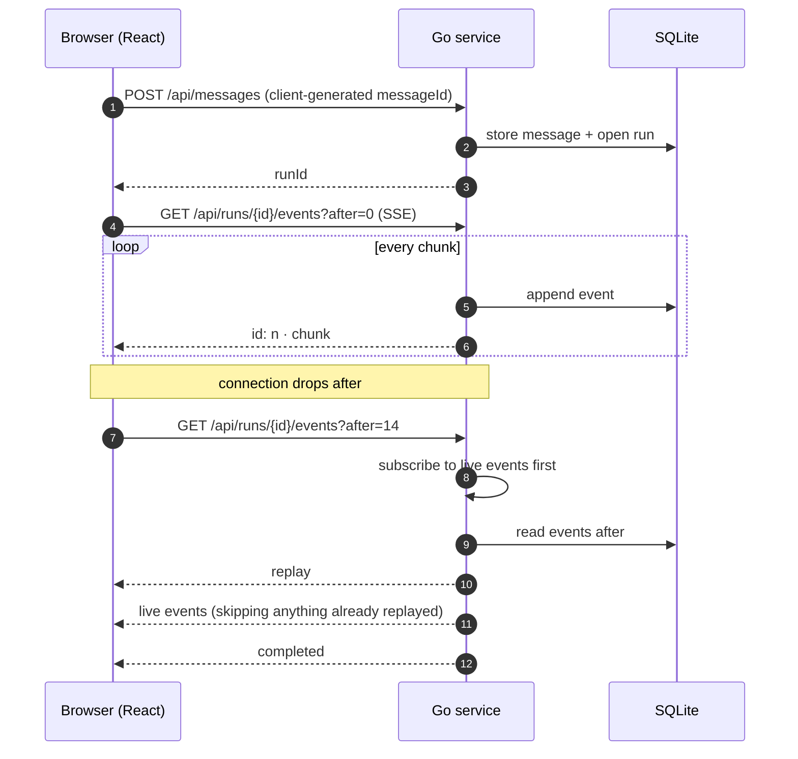

<div align="center">

# Relay

**Realtime streams that don't lose their place.**

A resumable realtime conversation: an answer streams in event by event, the connection can drop
mid-reply, and the client picks up exactly where it stopped — nothing missing, nothing repeated.


[Overview](#overview) · [How it works](#how-it-works) · [Tech stack](#tech-stack) · [Quick start](#quick-start) · [Protocol](#protocol) · [Reliability](#reliability-and-failure-handling) · [Trade-offs](#design-decisions-and-trade-offs)

</div>

> Built for the [Caygnus Product Engineering Challenge](../README.md), **Problem 1 — Resumable
> Realtime Conversation** ([brief](../problems/01-resumable-realtime-conversation/README.md)).
> Submission details, acceptance-scenario mapping and benchmark output are in
> [SUBMISSION.md](../SUBMISSION.md).

---

## Overview

Chat products stream replies so people can read them as they are generated. Connections drop,
laptops sleep, phones change networks, and servers restart — usually in the middle of a reply.
Naive implementations then restart the answer, show some text twice, skip some, or sit on a
stale screen that still says "connected".

Relay treats the stream as **durable history plus a disposable delivery pipe**:

- Every event is **stored first, then sent**, with a strict sequence number chosen by the server.
- A client that reconnects says *"give me everything after #N"* and receives exactly the events
  it missed, then continues live.
- A run ends **exactly once**, in one of `completed`, `failed` or `interrupted`, and a failed run
  can never later become a success.
- The UI tells the truth: connection state, run state and integrity numbers are derived from
  what actually arrived.

### What you can do in the demo

1. Press **Send** — a reply streams in event by event.
2. Press **Drop connection** while it is writing. The server keeps generating.
3. Press **Reconnect** — the events you missed are replayed (highlighted, tagged `REPLAYED`),
   then live delivery resumes.
4. Tick **Fail generator after 12 chunks** to watch a run fail cleanly, or stop the server
   mid-reply and restart it to see an honest `interrupted` state.

The top of the page explains what is happening in plain language. **Under the hood** (collapsed
by default) exposes the engineering evidence: run/conversation/message ids, integrity checks
(events received, expected, missing, duplicate, sequence validity), recovery details, the numbered
event log and the architecture.

---

## How it works



**The one rule that makes it correct: the database defines order, the connection only delivers it.**

| Concern | Where it lives |
| --- | --- |
| Event identity and ordering | `store` — a gapless `seq` assigned inside a transaction |
| Run state machine | `store` — `UPDATE … WHERE status = 'running'` lets exactly one terminal state win |
| Producing events | `runner` — the only writer; stores each chunk, then publishes it |
| Live fan-out | `hub` — in-memory and disposable; a slow client is dropped, never allowed to block generation |
| Replay → live handover | `api` — subscribe **before** reading history, then skip anything already replayed |
| Client cursor, dedupe, reconnect | `useRun.ts` — ignores any event at or below its cursor; bounded exponential backoff with jitter; a silence watchdog |

---

## Tech stack

| Layer | Choice | Why |
| --- | --- | --- |
| Backend | **Go** — `net/http`, no framework | Concurrency and state are the heart of the problem; goroutines, channels and `context` fit it. Go 1.22+ pattern routing covers three endpoints without a dependency. |
| Transport | **Server-Sent Events** | The reply only flows server → client. SSE is plain HTTP, resumable by design (`Last-Event-ID`), and inspectable with `curl`. WebSockets would add framing and ping/pong code for no gain. |
| Storage | **SQLite** (pure-Go driver `modernc.org/sqlite`) | Durability across restarts is a hard requirement, and one file means zero setup and no cgo. Transactions give atomic "assign sequence, append event, update state". |
| Frontend | **React 19 + TypeScript + Vite** | The interesting part is client state and types across the wire. Hand-written CSS, no UI library. |
| Tests | Go `testing` + race detector | Deterministic: scripted generator, no model API, no arbitrary sleeps. |
| Packaging (optional) | **Docker** + Render blueprint | Designed so one image serves the API and the built web app from a single origin. Not yet build-verified; the normal path is `go run` + `npm run dev`. |

**Dependencies are deliberately minimal** — one direct Go dependency (the SQLite driver) and
React/Vite on the web side.

---

## Quick start

**Prerequisites:** Go 1.27+ (see `server/go.mod`) and Node 20.19+ (tested on 22). No API keys,
no Docker, no external services.

```bash
# terminal 1 — API on :8080
cd server && go run ./cmd/server

# terminal 2 — UI on :5173 (its dev server proxies /api to :8080)
cd web && npm install && npm run dev
```

Open <http://localhost:5173>. Or use the shortcuts: `make server`, `make web`, `make test`, `make bench`.

### Tests and verification benchmark

```bash
cd server && go test -race ./...     # deterministic protocol tests
cd server && go run ./cmd/bench      # 30+ events, two forced disconnects
```

The benchmark starts a real server in-process, streams one reply, drops the connection twice
while generation is running, resumes from the client's cursor, and compares the reconstructed
text with the generator's own output. It exits non-zero on a single missing, duplicated or
out-of-order event:

```
PASS: 91 events, 0 missing, 0 duplicates, state=completed
```

The tests cover ordered live delivery, replay after a cursor, replay/live overlap, missed-event
recovery, generator failure after partial output, restart recovery, stale/invalid cursors,
reconnecting to an already-finished run, idempotent sends, gapless sequencing and the
exactly-one-terminal-state rule.

### Run it as one service (Docker — optional, experimental)

```bash
docker build -t relay .
docker run -p 8080:8080 relay        # UI and API on http://localhost:8080
```

The server serves the built UI at `/` when started with `-static <dir>`, and reads `$PORT`; that
single-process mode is tested locally. The container image itself is provided for convenience and
has not been build-verified yet. A [`render.yaml`](../render.yaml) blueprint is included for
free-tier hosting. Free instances
sleep when idle and have a non-persistent disk, so history resets on restart — fine for a demo,
not for production.

---

## Protocol

| Method & path | Purpose |
| --- | --- |
| `POST /api/messages` | Start a reply. Body: `conversationId`, `messageId` (client-generated), `text`. Retrying the same `messageId` returns the same run instead of starting a second one. |
| `GET /api/runs/{runId}` | Current durable state of a run (`status`, `lastSeq`). |
| `GET /api/runs/{runId}/events?after=<seq>` | SSE stream of every event after the cursor. Also honours `Last-Event-ID`. |

**SSE frames.** Events carry `id: <seq>` and a typed payload: `chunk`, `completed`, `failed`,
`interrupted`. Control frames — `state`, `ping`, `reset` — carry **no** `id`, so they can never
move a client's cursor.

**Explicit errors, never silent gaps.**

| Status | Meaning |
| --- | --- |
| `409 cursor_unavailable` | The cursor is ahead of stored history. The body includes the server's `lastSeq` so the client can recover. |
| `400 invalid_cursor` | The cursor is not a non-negative integer. |
| `404 run_not_found` | Unknown run. |

---

## Reliability and failure handling

| Situation | Behaviour |
| --- | --- |
| Connection drops mid-reply | The run keeps generating. On reconnect the client receives exactly the events after its cursor, then live events. |
| Replay overlaps live delivery | The server subscribes before replaying and skips already-sent sequences; the client drops anything at or below its cursor. |
| Generator fails after partial output | The run becomes `failed`, its history stays inspectable, and it can never become `completed`. |
| Server restarts mid-reply | On startup, runs still marked `running` become `interrupted` with a terminal event. Stored events stay correct; generation does **not** silently resume. |
| Cursor ahead of history | `409` with the server's `lastSeq`; the client re-syncs instead of showing a stream with a hole. |
| Connection looks open but is dead | The server pings every 5 s; the client treats 12 s of silence as a lost connection and reconnects. |
| Client falls behind the stream | The hub drops that subscriber with a `reset` frame instead of blocking generation; the client reconnects from its cursor. |
| Reconnect after a run finished | The server replays what is left and closes the stream. |

---

## Design decisions and trade-offs

- **Store first, publish second.** A live listener can never see an event that a reconnecting
  client would fail to find in history.
- **Subscribe before replay.** This closes the race where an event lands between "read history"
  and "start listening".
- **A restart is reported, not hidden.** Marking a run `interrupted` is honest and simple.
  Resuming generation would mean restarting a model call from a partial prefix — a product
  decision, not a protocol one.
- **Silence counts as failure.** Browsers reconnect `EventSource` silently, and a proxy can hold
  a socket open after its upstream dies. Without a ping and a watchdog the UI would say
  "connected" while receiving nothing.
- **The UI derives, it does not assume.** `LIVE` vs `REPLAYED`, missing/duplicate counts and
  sequence validity are computed from the events the client actually received. The run's status
  is only applied from a terminal *event*, never from the stream-open status message, so a run
  that finished while you were offline cannot show "completed" before its missed events arrive.

### Known limitations

- **Single server process.** The hub is in-memory; several instances would need Redis or
  Postgres notifications for fan-out. The store would remain the ordering authority.
- **History is unbounded.** Production would retain events for a window and answer an expired
  cursor with `409` plus the oldest available sequence.
- **One writer connection to SQLite** keeps sequencing simple; WAL plus a per-run lock is the
  next step.
- **The generator is a deterministic fake**, so tests and the benchmark are repeatable. It echoes
  the prompt at the start of every reply (`You said: …`).
- No authentication, rate limiting or multi-tenancy — out of scope for the challenge.

---

## Project structure

```text
.
├── server/                  Go service
│   ├── cmd/server           HTTP server (API, optional static UI)
│   ├── cmd/bench            verification benchmark
│   └── internal/
│       ├── store            durable event log + run state machine (SQLite)
│       ├── runner           produces events: store first, then publish
│       ├── hub              live fan-out to connected clients
│       ├── api              HTTP handlers + SSE framing + replay→live handover
│       ├── generator        deterministic fake model
│       └── sseclient        minimal SSE reader for tests and the benchmark
├── web/                     React + TypeScript client
│   └── src/
│       ├── useRun.ts        cursor, dedupe, reconnect, connection state machine
│       ├── metrics.ts       missing / duplicate / ordering, derived from events
│       ├── narration.ts     plain-language status derived from live state
│       └── components/      UI panels
├── Dockerfile · render.yaml · Makefile
└── SUBMISSION.md            challenge submission notes
```

---

<div align="center">

**Relay** · Resumable Conversation Demo · Built for unreliable networks

</div>
